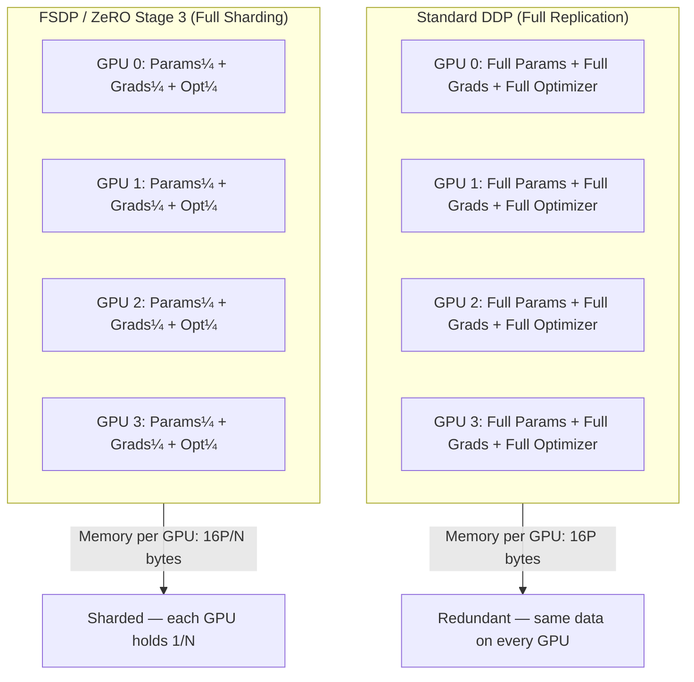
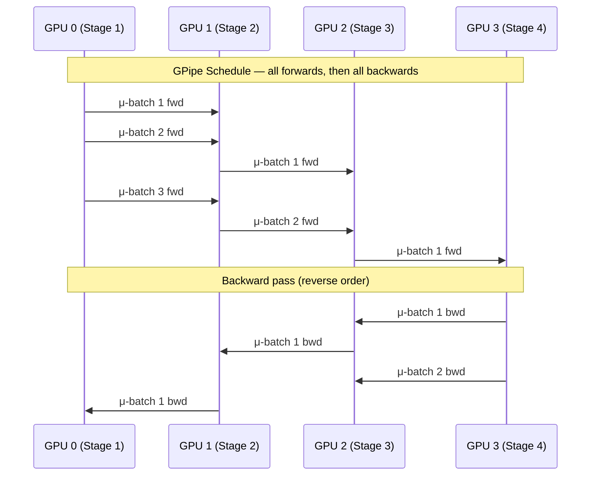
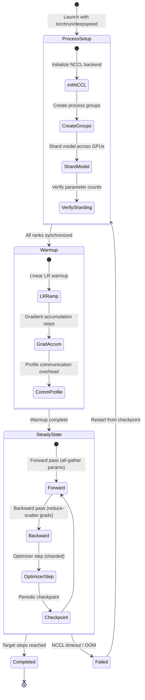

# Distributed Training at Scale

Multi-GPU and multi-node training implementations: FSDP (Fully Sharded Data Parallel), DeepSpeed ZeRO stages, pipeline parallelism, tensor parallelism, and gradient checkpointing. Benchmarks scaling efficiency.

## Theory & Background

### Why Distributed Training?

Modern language models don't fit on a single GPU. A 7B-parameter model in fp32 takes 28 GB just for the parameters — before you account for gradients (another 28 GB), optimizer states (56 GB for Adam), and activations. That's over 100 GB for a model that's small by today's standards. A single A100 has 80 GB. The math doesn't work.

The naive solution — data parallelism — replicates the entire model on every GPU and splits the data. Each GPU computes gradients on its shard of the batch, then all-reduces the gradients so every replica stays in sync. This works for models that fit on one GPU, but it doesn't solve the memory problem. Every GPU still holds a full copy of the model, gradients, and optimizer states.

Distributed training strategies solve this by partitioning the model itself across devices. The three main axes of parallelism are:

- **Data parallelism with sharding (FSDP/ZeRO)**: Shard the model parameters, gradients, and optimizer states across GPUs. Each GPU holds only a fraction of the model and gathers the full parameters on-demand for each layer's forward/backward pass. This is the most practical approach — it requires minimal code changes and scales to hundreds of GPUs.
- **Pipeline parallelism**: Split the model into sequential stages, each on a different GPU. Micro-batches flow through the pipeline like an assembly line. Simple to implement but introduces "bubble" overhead where GPUs sit idle waiting for their turn.
- **Tensor parallelism**: Split individual layers across GPUs. A single matrix multiplication is divided so each GPU computes a slice of the result. Extremely communication-intensive — requires NVLink-speed interconnects — but eliminates the memory bottleneck at the layer level.

In practice, large-scale training combines all three: tensor parallelism within a node (fast NVLink), pipeline parallelism across nodes in a rack, and data parallelism across racks.

### Data Parallelism and the ZeRO Insight

Standard data parallelism (DDP) replicates everything on every GPU. For a model with $P$ parameters using Adam, each GPU stores:

```math
M_{\text{DDP}} = 2P + 2P + (4P + 4P + 4P) = 16P \text{ bytes (in fp32)}
```

That's $2P$ for fp16 parameters, $2P$ for fp16 gradients, and $12P$ for the fp32 optimizer states (master weights, first moment, second moment). With $N$ GPUs, the total memory across the cluster is $16P \cdot N$ — the redundancy is enormous.

ZeRO (Zero Redundancy Optimizer) eliminates this redundancy in three stages:

```math
\begin{aligned}
\text{Stage 1:} \quad M_1 &= 2P + 2P + \frac{12P}{N} = 4P + \frac{12P}{N} \\
\text{Stage 2:} \quad M_2 &= 2P + \frac{2P + 12P}{N} = 2P + \frac{14P}{N} \\
\text{Stage 3:} \quad M_3 &= \frac{2P + 2P + 12P}{N} = \frac{16P}{N}
\end{aligned}
```

Stage 1 shards only the optimizer states — each GPU stores $1/N$-th of Adam's moment estimates. Stage 2 also shards the gradients. Stage 3 shards everything, including the parameters themselves. At Stage 3 with 64 GPUs, each GPU stores only $16P/64 = P/4$ bytes — a 64x reduction from DDP.

The cost is communication. Stage 3 requires an all-gather before each layer's forward pass (to reconstruct the full parameters) and a reduce-scatter after each layer's backward pass (to accumulate and re-shard gradients). This is the same communication volume as DDP's all-reduce, just reorganized — so the theoretical overhead is zero, though the pattern of many small collectives can be less efficient than DDP's fewer large ones.



### FSDP: Fully Sharded Data Parallel

PyTorch FSDP is the native implementation of ZeRO Stage 3. It wraps each module (or group of modules) in an FSDP unit. During the forward pass, each unit all-gathers its full parameters from all GPUs, runs the computation, then discards the non-local shards. During the backward pass, the same all-gather reconstructs parameters for gradient computation, followed by a reduce-scatter to accumulate gradients and re-shard them.

The key configuration choices in FSDP are:

- **Sharding strategy**: `FULL_SHARD` (ZeRO-3), `SHARD_GRAD_OP` (ZeRO-2), or `NO_SHARD` (DDP). Full sharding minimizes memory but maximizes communication.
- **Mixed precision**: Forward pass in fp16/bf16, gradient accumulation in fp32. Reduces memory and speeds up compute on tensor cores.
- **Activation checkpointing**: Recompute activations during the backward pass instead of storing them. Trades compute for memory — typically a 30-40% memory reduction at the cost of ~33% more compute.
- **Wrapping policy**: Which modules get their own FSDP unit. Wrapping each transformer layer separately allows overlapping communication with computation.

### Pipeline Parallelism

Pipeline parallelism splits the model into $S$ sequential stages, each assigned to a different GPU. A mini-batch is divided into $M$ micro-batches that flow through the pipeline. While GPU 0 processes micro-batch 2, GPU 1 processes micro-batch 1 — like an assembly line.

The problem is the pipeline bubble. At the start, only GPU 0 is working while the rest wait for data. At the end, only the last GPU is working while the rest wait for gradients. The bubble fraction — the proportion of time GPUs sit idle — is:

```math
\text{bubble fraction} = \frac{S - 1}{S - 1 + M} = \frac{S - 1}{S + M - 1}
```

where $S$ is the number of stages and $M$ is the number of micro-batches. With $S = 4$ stages and $M = 8$ micro-batches, the bubble is $3/11 \approx 27\%$ — more than a quarter of the compute is wasted. Increasing $M$ shrinks the bubble but increases memory (more micro-batches in flight) and latency.

Two scheduling strategies address this differently:

- **GPipe**: Run all forward micro-batches first, then all backward micro-batches. Simple but maximizes the bubble and requires storing activations for all $M$ micro-batches simultaneously.
- **1F1B (one-forward-one-backward)**: Interleave forward and backward passes. After the pipeline fills, each GPU alternates between forward and backward on consecutive micro-batches. This reduces peak memory from $O(M)$ to $O(S)$ activations and shrinks the bubble.



### Tensor Parallelism

Tensor parallelism splits individual weight matrices across GPUs. For a linear layer $Y = XW$ where $W \in \mathbb{R}^{d \times d}$, there are two natural ways to partition:

**Column parallelism**: Split $W$ along columns. Each GPU $i$ holds $W_i \in \mathbb{R}^{d \times d/N}$ and computes $Y_i = X W_i$. The partial results are concatenated (all-gather) to form the full output. This is used for the first linear layer in a transformer FFN.

**Row parallelism**: Split $W$ along rows. Each GPU $i$ holds $W_i \in \mathbb{R}^{d/N \times d}$ and needs the corresponding slice of the input. The partial results are summed (all-reduce) to form the full output. This is used for the second linear layer in a transformer FFN.

By pairing column-parallel and row-parallel layers, the all-gather from the first layer provides the distributed input needed by the second layer, and only one all-reduce is needed per FFN block:

```math
\text{FFN}(x) = \text{AllReduce}\left(\text{GeLU}(x W_1^{(i)}) \cdot W_2^{(i)}\right)
```

The communication cost per layer is one all-reduce of size $d$ (the hidden dimension). With $L$ transformer layers, each containing an attention block and an FFN, the total communication per forward pass is $4L$ all-reduces (two for attention, two for FFN). This is why tensor parallelism requires NVLink — on PCIe, the all-reduce latency dominates the compute time.

### Communication Costs and Scaling Efficiency

Each parallelism strategy has a different communication profile. The total communication volume per training step for a model with $P$ parameters, hidden dimension $d$, $L$ layers, and $N$ GPUs:

| Strategy | Communication per step | Pattern | Bottleneck |
|----------|----------------------|---------|------------|
| DDP | $2P$ (all-reduce) | One large collective | Bandwidth |
| FSDP (ZeRO-3) | $3P$ (all-gather + reduce-scatter) | Many small collectives per layer | Latency |
| Pipeline ($S$ stages, $M$ μ-batches) | $2 \cdot S \cdot M \cdot d$ (point-to-point) | Sequential, between adjacent GPUs | Bubble overhead |
| Tensor ($N$-way) | $4L \cdot 2d$ (all-reduce per layer) | Frequent, within-node | Latency, requires NVLink |

Scaling efficiency measures how much useful compute you get as you add GPUs:

```math
\eta(N) = \frac{T_1}{N \cdot T_N}
```

where $T_1$ is the single-GPU training time and $T_N$ is the $N$-GPU training time. Perfect linear scaling gives $\eta = 1.0$. In practice, FSDP achieves $\eta \approx 0.90$-$0.95$ on InfiniBand clusters up to 64 GPUs, degrading to $\eta \approx 0.80$-$0.85$ at 256 GPUs as communication overhead grows.

### Gradient Checkpointing

Activation memory grows linearly with model depth. For a transformer with $L$ layers, batch size $B$, and sequence length $S$, the activation memory is roughly:

```math
M_{\text{act}} \approx 2 \cdot B \cdot S \cdot d \cdot L \text{ bytes (in fp16)}
```

For a 7B model ($d = 4096$, $L = 32$) with $B = 4$ and $S = 2048$, this is about 34 GB — often more than the parameters themselves. Gradient checkpointing trades compute for memory by discarding intermediate activations during the forward pass and recomputing them during the backward pass.

With checkpointing every $k$ layers, the activation memory drops to:

```math
M_{\text{ckpt}} \approx 2 \cdot B \cdot S \cdot d \cdot \left(\frac{L}{k} + k\right)
```

The optimal checkpoint interval is $k = \sqrt{L}$, which minimizes the sum of stored checkpoints ($L/k$) and recomputed activations within each segment ($k$). For $L = 32$, this gives $k \approx 6$, reducing activation memory by roughly 5x at the cost of ~33% additional compute.

### Training Lifecycle

A distributed training run progresses through setup, warmup, and steady-state phases. The setup phase is critical — misconfigured process groups, mismatched sharding, or NCCL initialization failures are the most common sources of distributed training bugs.



### Training Timeline

A typical distributed training run with FSDP on 8 GPUs. The timeline shows how communication overlaps with computation during steady-state training, and how checkpointing introduces periodic pauses.

```mermaid
gantt
    title FSDP Training on 8x A100 GPUs
    dateFormat X
    axisFormat %s

    section Setup
        NCCL init + process groups      :0, 1
        Model sharding (ZeRO-3)         :1, 2
        Verify sharding + dry run       :2, 3

    section Training
        LR warmup (1000 steps)          :3, 5
        Steady-state training           :5, 18
        LR cosine decay                 :14, 18

    section Communication
        All-gather (forward)            :5, 18
        Reduce-scatter (backward)       :5, 18
        Overlap with compute            :5, 18

    section Checkpointing
        Distributed checkpoint (every 1k steps) :6, 18
        Validation runs                 :8, 18

    section Profiling
        Throughput measurement          :5, 18
        NCCL comm profiling             :5, 10
        Scaling efficiency report       :18, 20
```



### Tradeoffs and Alternatives

| Decision | Choice | Alternative | Why this choice |
|----------|--------|-------------|-----------------|
| Primary sharding | FSDP (ZeRO-3) | DDP, ZeRO-1/2 | FSDP minimizes per-GPU memory, enabling larger models; DDP can't fit large models; ZeRO-1/2 leave parameters replicated, wasting memory |
| DeepSpeed integration | ZeRO Stage 3 with offloading | ZeRO-Infinity, 3D parallelism | ZeRO-3 covers most use cases; ZeRO-Infinity's CPU/NVMe offloading adds latency; 3D parallelism is needed only at extreme scale (175B+) |
| Pipeline schedule | 1F1B | GPipe, interleaved 1F1B | 1F1B reduces peak memory from $O(M)$ to $O(S)$ activations; GPipe is simpler but wastes memory; interleaved 1F1B further reduces bubble but complicates implementation |
| Tensor parallelism | Column/row splitting | Sequence parallelism, expert parallelism | Column/row is the standard Megatron-LM approach; sequence parallelism is complementary (splits along sequence dimension); expert parallelism is specific to MoE models |
| Checkpointing | Per-layer activation checkpointing | Selective checkpointing, no checkpointing | Per-layer is the simplest and most predictable; selective checkpointing (only attention) saves less memory; no checkpointing is only viable for small models |
| Communication backend | NCCL | Gloo, MPI | NCCL is optimized for NVIDIA GPUs and supports NVLink/InfiniBand; Gloo is CPU-only fallback; MPI adds deployment complexity with no performance benefit on NVIDIA hardware |

**When FSDP is the right choice**: Models that fit on a single node's aggregate memory but not on a single GPU. This covers the 1B-30B parameter range on 8x A100 nodes. Minimal code changes from DDP — wrap the model and adjust the launch script.

**When pipeline parallelism is needed**: Models too large for a single node even with FSDP. Pipeline parallelism's point-to-point communication works well across nodes with slower interconnects. The bubble overhead is the price of simplicity.

**When tensor parallelism is needed**: Within a node, when even FSDP's all-gather latency is too high for the target throughput. Tensor parallelism keeps the computation distributed at all times, avoiding the gather-compute-scatter pattern. Only practical with NVLink.

**When all three are combined**: Training at the frontier — 100B+ parameter models on thousands of GPUs. Megatron-LM's 3D parallelism uses tensor parallelism within a node (8-way), pipeline parallelism across nodes in a rack (4-8 stages), and data parallelism across racks.

### Key References

- Rajbhandari et al., "ZeRO: Memory Optimizations Toward Training Trillion Parameter Models" (2020) — [arXiv:1910.02054](https://arxiv.org/abs/1910.02054)
- Zhao et al., "PyTorch FSDP: Experiences on Scaling Fully Sharded Data Parallel" (2023) — [arXiv:2304.11277](https://arxiv.org/abs/2304.11277)
- Huang et al., "GPipe: Efficient Training of Giant Neural Networks using Pipeline Parallelism" (2019) — [arXiv:1811.06965](https://arxiv.org/abs/1811.06965)
- Narayanan et al., "Efficient Large-Scale Language Model Training on GPU Clusters Using Megatron-LM" (2021) — [arXiv:2104.04473](https://arxiv.org/abs/2104.04473)
- Shoeybi et al., "Megatron-LM: Training Multi-Billion Parameter Language Models Using Model Parallelism" (2019) — [arXiv:1909.08053](https://arxiv.org/abs/1909.08053)
- Ren et al., "ZeRO-Offload: Democratizing Billion-Scale Model Training" (2021) — [arXiv:2101.06840](https://arxiv.org/abs/2101.06840)

## Real-World Applications

Distributed training enables organizations to train models that would be impossible on a single machine, turning GPU clusters into a unified compute resource. This is the infrastructure layer that makes modern large-scale AI possible — without it, models beyond a few billion parameters simply couldn't be trained.

| Industry | Use Case | Impact |
|----------|----------|--------|
| AI Research Labs | Training foundation models (GPT-scale, LLaMA-scale) across hundreds or thousands of GPUs with mixed parallelism strategies | Enables the creation of models that define the state of the art, with training runs that would take decades on a single GPU completed in weeks |
| Cloud Providers | Offering managed distributed training services (SageMaker, Vertex AI, Azure ML) that abstract away the complexity of multi-node setup | Customers train large models without managing NCCL configuration, process groups, or checkpoint coordination — reducing time-to-model from months to days |
| Enterprise ML Platforms | Fine-tuning large pre-trained models on proprietary data using FSDP or DeepSpeed, running on internal GPU clusters | Organizations adapt foundation models to their domain (legal, medical, financial) without sending data to external APIs, maintaining compliance and data sovereignty |
| Autonomous Vehicles | Training perception and planning models on massive driving datasets (petabytes of sensor data) that require distributed processing | Faster iteration cycles on safety-critical models — a training run that took two weeks on 8 GPUs completes in two days on 64, enabling more experiments per quarter |
| Drug Discovery | Training protein structure prediction and molecular generation models on large biological datasets across multi-node GPU clusters | Accelerated drug candidate screening by training larger, more accurate models that capture complex molecular interactions — reducing wet-lab iterations |

## Project Structure

```
├── src/
│   ├── fsdp/
│   │   ├── trainer.py         # FSDP training loop
│   │   ├── sharding.py        # Sharding strategy config
│   │   └── checkpointing.py   # FSDP checkpoint save/load
│   ├── deepspeed/
│   │   ├── trainer.py         # DeepSpeed training loop
│   │   └── configs/           # ZeRO stage configs
│   ├── pipeline/
│   │   ├── schedule.py        # Pipeline schedule (GPipe, 1F1B)
│   │   └── partition.py       # Model partitioning
│   ├── tensor_parallel/
│   │   ├── layers.py          # Column/row parallel linear
│   │   └── comm.py            # All-reduce, all-gather wrappers
│   ├── profiling/
│   │   ├── throughput.py      # Tokens/sec measurement
│   │   └── comm_profile.py    # NCCL communication profiling
│   └── utils/
│       └── distributed.py     # Distributed setup utilities
├── configs/
│   ├── fsdp_config.yaml
│   └── deepspeed_zero3.json
├── scripts/
│   ├── launch_fsdp.sh         # torchrun launch script
│   └── launch_deepspeed.sh    # deepspeed launch script
├── notebooks/
│   └── walkthrough.ipynb
├── requirements.txt
└── README.md
```

## Quick Start

```bash
pip install -r requirements.txt

# Single-node multi-GPU with FSDP
torchrun --nproc_per_node=2 -m src.fsdp.trainer --config configs/fsdp_config.yaml

# DeepSpeed ZeRO-3
deepspeed src/deepspeed/trainer.py --deepspeed configs/deepspeed_zero3.json

# Profile communication overhead
python -m src.profiling.comm_profile --backend nccl --nproc 4

# Measure scaling efficiency
torchrun --nproc_per_node=4 -m src.profiling.throughput --config configs/fsdp_config.yaml
```

## Implementation Details

### What makes this non-trivial

- **FSDP sharding strategies**: Supports `FULL_SHARD` (ZeRO-3), `SHARD_GRAD_OP` (ZeRO-2), and `NO_SHARD` (DDP) with configurable wrapping policies — each transformer layer is wrapped as a separate FSDP unit to enable communication-computation overlap during the backward pass
- **Mixed precision with loss scaling**: Forward pass in bf16, gradient accumulation in fp32, with dynamic loss scaling to prevent underflow; the sharded optimizer maintains fp32 master weights while the forward pass uses the reduced-precision copy
- **Activation checkpointing integration**: Per-layer checkpointing with FSDP that recomputes activations during the backward pass, reducing activation memory by ~5x at the cost of ~33% additional compute; checkpoint boundaries align with FSDP unit boundaries to avoid materializing full parameters unnecessarily
- **Pipeline schedule implementation**: Both GPipe (all-forward-then-all-backward) and 1F1B (interleaved) schedules with configurable micro-batch count; 1F1B reduces peak activation memory from $O(M)$ to $O(S)$ and shrinks the pipeline bubble
- **Tensor parallel linear layers**: Column-parallel and row-parallel linear layers following the Megatron-LM pattern, with fused all-reduce operations that overlap communication with the next layer's computation
- **NCCL communication profiling**: Instruments all collective operations (all-gather, reduce-scatter, all-reduce, point-to-point) with timing and bandwidth measurements, producing per-layer communication breakdowns to identify bottlenecks
- **Distributed checkpointing**: Saves and loads sharded model state without gathering to a single rank, using PyTorch's distributed checkpoint API; supports resuming training across different GPU counts by resharding on load
